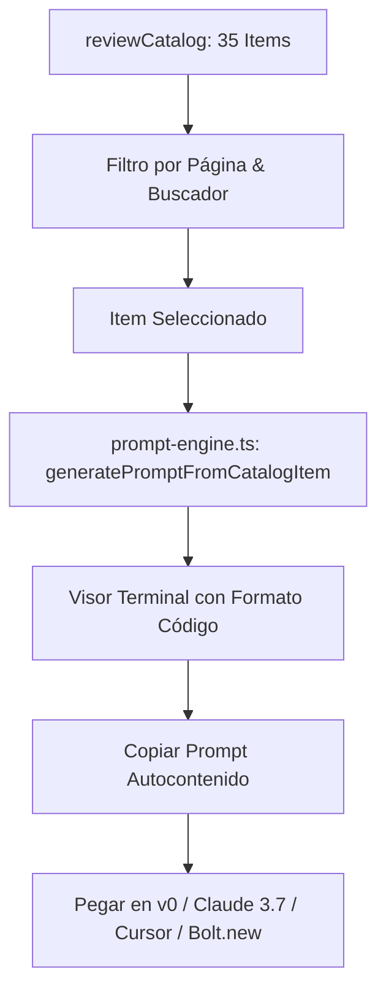

# Manual Técnico y Funcional: Sistema de Prompts y Generadores en DosRuedas-Pro

**Módulos Documentados:**
- [`/prompts`](file:///D:/00proyectos/DosRuedas-Pro/src/app/prompts/page.tsx) — Catálogo T1–T23 de Tipografía 3D y Sellos de Identidad.
- [`/generador-prompts`](file:///D:/00proyectos/DosRuedas-Pro/src/app/generador-prompts/page.tsx) — Generador Dual: Componentes UI/UX (35 Secciones) y Assets Visuales R2I (68 Presets).

**Versión:** 2026.1 · **Edición:** Mar del Plata, Argentina  
**Diseño:** Contrato Visual Inmutable (Next.js 16, Tailwind CSS, TypeScript, Genkit AI)

---

## 1. Resumen Ejecutivo

Dentro del ecosistema de **Dos Ruedas Pro**, las rutas `/prompts` y `/generador-prompts` constituyen el **centro neurálgico de diseño, consistencia de marca e ingeniería de prompts**. Su objetivo es garantizar que tanto desarrolladores frontend como motores de inteligencia artificial generativa (*v0, Cursor, Claude 3.7 Sonnet, Gemini 2.5 Flash Image, Nano Banana 2, Midjourney v6*) produzcan interfaces y assets 100% alineados al contrato visual oficial de la empresa en Mar del Plata.

```
┌────────────────────────────────────────────────────────────────────────────────────────┐
│                                DOS RUEDAS PRO (App Router)                             │
├───────────────────────────────────────────┬────────────────────────────────────────────┤
│           /prompts                        │            /generador-prompts              │
│  (src/app/prompts/page.tsx)               │  (src/app/generador-prompts/page.tsx)      │
├───────────────────────────────────────────┼────────────────────────────────────────────┤
│ • Catálogo T1 a T23 Tipografía 3D         │ • Modo 1: 35 Componentes UI/UX            │
│ • Sello Ancla Tipográfica (TYPE_ANCHOR)   │   (reviewCatalog + prompt-engine.ts)       │
│ • Tarjetas Double-Bezel con Neón Glow     │ • Modo 2: 68 Presets Visuales & R2I        │
│ • Directivas Midjourney v6 / Octane       │ • Workbench Interactivo con Gemini AI      │
│ • Filtro por 7 categorías especializadas  │ • Inyección de 4 leyes visuales 2026       │
└───────────────────────────────────────────┴────────────────────────────────────────────┘
```

---

## 2. Módulo A: Catálogo de Tipografía 3D (`/prompts`)

### 2.1. Propósito y Ubicación
- **Ruta de acceso:** `/prompts`
- **Archivo fuente:** [`src/app/prompts/page.tsx`](file:///D:/00proyectos/DosRuedas-Pro/src/app/prompts/page.tsx)
- **Función principal:** Catálogo interactivo de 23 directivas de renderizado tipográfico 3D extruido, sellos de goma, insignias de estado y parches tácticos para la marca Envíos DosRuedas.

### 2.2. El Ancla Tipográfica Maestra (`TYPE_ANCHOR`)
Cada prompt de este catálogo incorpora como prefijo una directiva de anclaje que bloquea desviaciones cromáticas o tipográficas:

```text
Bold condensed all-caps sans-serif lettering inspired by Anton and Bebas Neue display typography, heavy visual weight, tight letter-spacing, strictly governed by the Envíos DosRuedas 3-color palette: Egyptian Royal Navy Blue (#0636A5 / #021440), Electric Kinetic Yellow (#FFEC01), and Pure White (#FFFFFF). Render the quoted text exactly on a single line, with zero spelling mistakes, no unwanted artifacts, and no third-party logos. Clean pure-white or deep-blue ground as specified, centered composition with generous negative space for UI cropping.
```

### 2.3. Categorización de los 23 Assets (T1 – T23)

| Código | Título | Categoría | Ratio / Res | Destino UI / Componente | Motor Recomendado |
| :--- | :--- | :--- | :--- | :--- | :--- |
| **T1** | `"ENVÍOS EXPRESS"` | Servicios | 3:2 · 2K | `ExpressHero.tsx` / `ServiceCard.tsx` | Midjourney v6 / Octane |
| **T2** | `"ENVÍOS LOWCOST"` | Servicios | 3:2 · 2K | `LowCostHero.tsx` / `LowCostSheet.tsx` | Midjourney v6 / Octane |
| **T3** | `"ENVÍOS FLEX"` | Servicios | 3:2 · 2K | `FlexHero.tsx` (Mercado Libre) | Midjourney v6 / Octane |
| **T4** | `"PLAN EMPRENDEDORES"` | Servicios | 3:2 · 2K | `EmprendedoresHero.tsx` | Photorealistic PBR |
| **T5** | `"E-COMMERCE & 3PL"` | Servicios | 3:2 · 2K | `FulfillmentHero.tsx` (Hub Chauvín) | Midjourney v6 / Octane |
| **T6** | `"SAME DAY"` | Sellos | 1:1 · 1K | Badges de entrega en el día / Cards | Vector 3D Render |
| **T7** | `"NEXT DAY"` | Sellos | 1:1 · 1K | Tarjetas LowCost diferidas | Vector 3D Render |
| **T8** | `"24 HS"` | Sellos | 1:1 · 1K | SLA de ruteo agrupado | Vector 3D Render |
| **T9** | `"SIN CARGO"` | Sellos | 1:1 · 1K | Pickup bonificado / Promociones | 3D Studio Render |
| **T10** | `"HOY MISMO"` | Frases Hero | 16:9 · 2K | Hero Banner / Stories | Flat Graphic + Glow |
| **T11** | `"COTIZÁ TU ENVÍO"` | Frases Hero | 16:9 · 2K | `CTAFinal.tsx` / Conversion Header | Vector Grid 3D |
| **T12** | `"ENTREGA EN EL DÍA"` | Frases Hero | 16:9 · 2K | Banners de confianza / Redes | Neon Tubular 3D |
| **T13** | `"MDQ"` (Parche) | Parches & Wordmarks | 1:1 · 1K | Badges de identidad local / Footer | Macro Bordado Táctico |
| **T14** | `"FRIULI 1972"` | Parches & Wordmarks | 3:2 · 1K | Base Chauvín / Contacto | Sticker Vinilo Troquelado |
| **T15** | `"DOSRUEDAS"` | Parches & Wordmarks | 3:2 · 2K | Logomarca secundaria / Merch | Vector Graphic |
| **T16** | `"+50K"` (Envíos) | Cifras 3D | 1:1 · 2K | `TrustBar.tsx` (Métricas) | Cromo Espejo Octane |
| **T17** | `"0"` (Extraviados) | Cifras 3D | 1:1 · 2K | `TrustBar.tsx` (Seguridad) | Glossy Navy con Tilde |
| **T18** | `"+7 AÑOS"` | Cifras 3D | 1:1 · 2K | `TrustBar.tsx` / Sobre Nosotros | Extruido 3D Amarillo |
| **T19** | `"FRÁGIL"` | Embalaje | 1:1 · 1K | Mockups / Fondos kraft | Sello de Tinta de Goma |
| **T20** | `"ESTE LADO ARRIBA"` | Embalaje | 1:1 · 1K | Mockups / Logística | Sello de Tinta de Goma |
| **T21** | `"RUTEO ACTIVO"` | Social & Status | 3:2 · 1K | Indicador GPS en vivo / Hero | Pastilla 3D con LED |
| **T22** | `"ENTREGADO"` | Social & Status | 3:2 · 1K | Notificaciones de tracking / SLA | Pastilla Blanca 3D |
| **T23** | `"#RUTASMDQ"` | Social & Status | 1:1 · 1K | Campañas Instagram Community | Letras de Goma 3D |

### 2.4. Características de la Interfaz (`PromptsPage`)
1. **Filtro Rápido por Categorías:** Pastillas dinámicas en `Bebas Neue` (*Todos, Servicios, Sellos, Frases Hero, Parches & Wordmarks, Cifras 3D, Embalaje, Social & Status*).
2. **Buscador en Tiempo Real:** Búsqueda simultánea por código (`T1`), palabra clave, archivo destino o componente React.
3. **Double-Bezel Glass Card Layout:** Contenedores con estética Enterprise que simulan terminales tácticas oscuras con bordes luminosos.
4. **Copiado Inteligente con 1-Clic:**
   - **Copiar Solo el Ancla:** Extrae únicamente el `TYPE_ANCHOR`.
   - **Copiar Prompt Completo:** Concatena automáticamente `TYPE_ANCHOR + Prompt Específico`.

---

## 3. Módulo B: Generador de Prompts UI/UX & Assets (`/generador-prompts`)

### 3.1. Propósito y Ubicación
- **Ruta de acceso:** `/generador-prompts`
- **Archivo fuente:** [`src/app/generador-prompts/page.tsx`](file:///D:/00proyectos/DosRuedas-Pro/src/app/generador-prompts/page.tsx)
- **Función principal:** Centro de control unificado con **Modo Dual**:
  1. **Generador de Componentes UI/UX**: Procesa las 35 secciones de [`src/lib/reviewCatalog.ts`](file:///D:/00proyectos/DosRuedas-Pro/src/lib/reviewCatalog.ts) mediante el motor [`src/lib/prompt-engine.ts`](file:///D:/00proyectos/DosRuedas-Pro/src/lib/prompt-engine.ts).
  2. **Explorador y Workbench de Assets Visuales R2I**: 68 presets fotográficos, 3D e iconográficos con conexión interactiva a Gemini AI vía Genkit.

---

### 3.2. Modo 1: Generador de Prompts UI/UX (35 Secciones de Catálogo)

#### 3.2.1. Arquitectura y Flujo de Transformación
El usuario selecciona una sección auditada o filtra por página. El motor [`generatePromptFromCatalogItem`](file:///D:/00proyectos/DosRuedas-Pro/src/lib/prompt-engine.ts) genera al instante un prompt autocontenido con:
- **Rol del Asistente:** Senior Frontend & Next.js 16 UI Architect.
- **Componente Objetivo y Ruta:** Archivo físico del proyecto.
- **Requerimientos Funcionales:** Extraídos del catálogo.
- **Tokens y Clases Inmutables:** Zero generic grays, colores de marca, tipografías y radios.
- **Tono Local:** Voseo rioplatense y referencias a Mar del Plata (Chauvín, Friuli 1972, Batán).



#### 3.2.2. Vistas Cubiertas por el Catálogo (10 Páginas / 35 Módulos)
1. **Home / Inicio (6 secciones):** Hero (`home-hero`), Visión (`home-vision`), Servicios (`home-services`), Slider (`home-slider`), Emprendedores (`home-emprendedores`), CTA Final (`home-cta`).
2. **Cotizador Express (4 secciones):** Hero (`cotizar-express-hero`), Formulario Interactivo (`cotizar-express-form`), Condiciones (`cotizar-express-details`), Soporte Cadetería (`cotizar-express-help`).
3. **Cotizador LowCost (4 secciones):** Hero (`cotizar-lowcost-hero`), Formulario Interactivo (`cotizar-lowcost-form`), Condiciones (`cotizar-lowcost-details`), Cuentas Corporativas (`cotizar-lowcost-help`).
4. **Sobre Nosotros (6 secciones):** Quiénes Somos (`about-hero`), Ventajas (`about-advantages`), Valores (`about-values`), Línea de Tiempo (`about-timeline`), Flota (`about-team`), Misión y Visión (`about-mission`).
5. **Preguntas Frecuentes (3 secciones):** FAQ Hero (`faq-hero-comp`), Acordeón (`faq-accordion-comp`), Asistencia Directa (`faq-cta-comp`).
6. **Comunidad y Redes (5 secciones):** Redes Hero (`networks-hero-comp`), Canales (`networks-channels`), Feed Novedades (`recent-posts`), Beneficios (`networks-benefits`), Newsletter (`newsletter-subscribe`).
7. **Servicio Express Detallado (4 secciones):** Hero (`service-express-hero`), Features (`service-express-features`), Tarifas Zonas (`service-express-pricing`), Casos de Uso (`service-express-usecases`).
8. **Servicio LowCost Detallado (5 secciones):** Hero (`service-lowcost-hero`), Features (`service-lowcost-features`), Tarifas (`service-lowcost-pricing`), Beneficios (`service-lowcost-benefits`), Cómo Funciona (`service-lowcost-howitworks`).
9. **Servicio Flex Mercado Libre (6 secciones):** Hero (`service-flex-hero`), Features (`service-flex-features`), Beneficios (`service-flex-benefits`), Tarifas Homologadas (`service-flex-pricing`), Cronograma 15:00 a 20:00 hs (`service-flex-howitworks`), Requisitos (`service-flex-requirements`).
10. **Plan Emprendedores 3PL & Contacto/Legales (6 secciones):** Hero 3PL Friuli 1972 (`service-emp-hero`), Formulario Contacto (`contact-form-comp`), Info Base Chauvín (`contact-info-comp`), Términos y Privacidad (`privacidad-page-comp`, `terminos-page-comp`).

---

### 3.3. Modo 2: Assets Visuales & Workbench R2I (68 Presets + Gemini AI)

#### 3.3.1. Grupos de la Biblioteca (`PROMPT_LIBRARY`)
- **Grupo 1: Fotos Comerciales (IMG-1 a IMG-21):** Mensajeros en la costa, Rambla, Güemes, depósito Friuli 1972, entregas puerta a puerta y flat-lays legales.
- **Grupo 2: Assets de Marca y 3D (BRD-A1 a BRD-H1):** Cajas kraft cerradas/abiertas, bolsas e-commerce con QR, scooters en perspectiva/perfil, furgones 3PL, mapas isométricos Z1–Z5 y sets de iconos duotono.
- **Grupo 3: Tipografía 3D (TYP-T1 a TYP-T23):** Duplicados estructurados de la serie T con metadatos extendidos para IA.

#### 3.3.2. Workbench R2I Interactivo (Genkit + Gemini 2.5 Flash)
Permite al usuario cargar cualquier preset en el configurador o crear uno nuevo:
- **Campos:** Tipo de recurso, Sujeto/Acción principal, Locación (Mar del Plata), Cámara/Motor, Relación de Aspecto (`--ar`), Archivo destino y Componente UI.
- **Procesamiento AI:** Envía la petición a `/api/generate-prompt` (ejecuta el flujo `generate-asset-prompt.ts`), el cual inyecta el ancla de marca correspondiente y estructura la salida en bloques (Sujeto, Entorno, Iluminación, Calibración cromática y Alt text en español).

---

## 4. Estándares Técnicos y Rendimiento (Vercel React Best Practices)

Ambas páginas han sido optimizadas siguiendo las directrices de alto rendimiento de React y Next.js 16:
1. **Eliminación de Re-renders Innecesarios:** Todos los listados y transformaciones de prompts utilizan `useMemo` y `useCallback` con dependencias primitivas.
2. **Lazy State Initialization:** Inicialización perezosa en estados complejos (`useState(() => ...)`).
3. **Bundle Size:** Uso de importaciones directas de iconos `lucide-react` sin barrel files pesados.
4. **Accesibilidad (WCAG AA):** Contraste óptico estricto en superficies oscuras (`#021440`, `#052C87`) y claras (`#F8FAFC`), tamaños de fuente legibles y elementos interactivos accesibles por teclado.

---

## 5. Guía de Uso Rápido para el Desarrollador

### ¿Cómo generar el código para un componente nuevo o existente?
1. Navega a `/generador-prompts`.
2. Asegúrate de estar en el modo **"35 COMPONENTES UI/UX"**.
3. Selecciona la página (ej: *Servicio Flex*) o escribe el nombre del componente en el buscador (ej: *FlexHowItWorks*).
4. Haz clic en **"COPIAR PROMPT AUTOCONTENIDO"**.
5. Pega el prompt en **v0.dev**, **Claude 3.7 Sonnet**, **Cursor** o **Bolt.new**. El código devuelto encajará directamente en la arquitectura de DosRuedas-Pro.

### ¿Cómo generar una imagen publicitaria o asset 3D?
1. Navega a `/prompts` para tipografía 3D o a `/generador-prompts` (Modo **"ASSETS VISUALES & R2I"**).
2. Haz clic en **"1-CLIC COPIAR"** para usar el prompt directo con ancla incluida.
3. Si deseas personalizar el encuadre o iluminación, pulsa **"PERSONALIZAR"** para cargarlo en el Workbench y generar una variante calibrada con Gemini AI.
