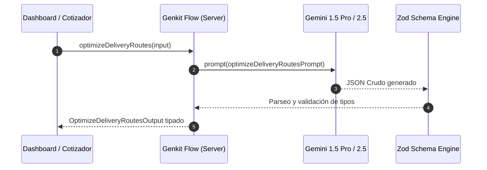

# Documentación Técnica Integral: Motores de Prompts e Inteligencia Artificial en DosRuedas-Pro

**Versión:** 2026.1 · **Edición:** Mar del Plata, Argentina  
**Ámbito:** Arquitectura de Prompts, Contrato Visual Inmutable y Flujos de Inferencia con Google Genkit & Gemini  

---

## 1. Resumen Ejecutivo y Arquitectura General

La plataforma **Dos Ruedas Pro** implementa una arquitectura híbrida de Inteligencia Artificial que desacopla la generación de interfaces, la síntesis de piezas visuales/3D y la optimización algorítmica de rutas logísticas.

El sistema se compone de tres motores principales:

1. **Motor UI/UX de Generación de Prompts Frontend (`src/lib/prompt-engine.ts` & `src/lib/reviewCatalog.ts`)**: Transforma los 35 módulos y vistas auditadas en especificaciones técnicas de alta precisión para asistentes de código (*v0, Cursor, Claude 3.7 Sonnet, Bolt.new*).
2. **Motor de Assets Visuales & R2I (`src/ai/flows/generate-asset-prompt.ts` & `src/data/prompt-library.ts`)**: Calibra y estructura prompts en inglés con anclas de marca (*Brand Anchors*) optimizados para **Google Nano Banana 2 (Gemini 2.5 Flash Image)**, Midjourney v6.0 y Flux.
3. **Motor de Optimización de Rutas Logísticas (`src/ai/flows/optimize-delivery-routes.ts` & `src/ai/genkit.ts`)**: Agente en servidor (Genkit Flow) que procesa pedidos B2B, capacidades vehiculares y restricciones de tráfico para devolver itinerarios óptimos validados contra esquemas Zod.

```
                                  ┌────────────────────────────────────────────────────────┐
                                  │                DOS RUEDAS PRO (src/)                   │
                                  └──────────────────────────┬─────────────────────────────┘
                                                             │
        ┌────────────────────────────────────────────────────┼────────────────────────────────────────────────────┐
        │                                                    │                                                    │
        ▼                                                    ▼                                                    ▼
┌───────────────────────────────┐    ┌───────────────────────────────────────────────┐    ┌───────────────────────────────┐
│   1. MOTOR UI/UX (Frontend)   │    │      2. MOTOR R2I / ASSETS (Visual & 3D)      │    │  3. MOTOR LOGÍSTICO (Genkit)  │
│  src/lib/prompt-engine.ts     │    │  src/ai/flows/generate-asset-prompt.ts        │    │  src/ai/flows/optimize-...ts  │
│  src/lib/reviewCatalog.ts     │    │  src/data/prompt-library.ts                   │    │  src/ai/genkit.ts             │
├───────────────────────────────┤    ├───────────────────────────────────────────────┤    ├───────────────────────────────┤
│ • 35 Secciones de catálogo    │    │ • 68 Presets de imagen y tipografía           │    │ • Optimización de rutas B2B   │
│ • Prompts para v0, Cursor,    │    │ • Anclas de Marca (Foto, 3D, Iso, Iconos)     │    │ • Orden de paradas y SLAs     │
│   Claude 3.7 y Bolt.new       │    │ • Modelo: Gemini 2.5 Flash / Nano Banana 2    │    │ • Consumo y tiempos Mar del Pl│
│ • Contrato Visual Inmutable   │    │ • Calibración cromática y de consistencia     │    │ • Salida tipada con Zod       │
└───────────────────────────────┘    └───────────────────────────────────────────────┘    └───────────────────────────────┘
```

---

## 2. Motor 1: Generación de Prompts UI/UX (Frontend Components)

### 2.1. Propósito
Proveer a desarrolladores y modelos de generación de código una directiva unificada e infalible para construir o refactorizar cualquiera de los 35 componentes de la plataforma, respetando el contrato visual 2026 sin introducir grises genéricos ni estilos inconsistentes.

### 2.2. Contrato Visual Inmutable
Todo prompt generado inyecta de forma estricta las siguientes reglas:

| Token / Dimensión | Valor / Regla | Aplicación UI |
| :--- | :--- | :--- |
| **Brand Primary** | `#0636A5` | Azul institucional corporativo (Speed Blue) |
| **Dark Cards / Profundidad** | `#052C87` y `#031E5C` | Midnight Navy y Deep Navy con backdrop-blur |
| **Acentos & Conversión** | `#FFF12E` / `#FFEC01` | High-Voltage Neon para badges, botones principales y resaltados |
| **Superficies Claras** | `#FFFFFF` / `#F8FAFC` | Surface para legales y tablas, con texto on-surface `#052C87` |
| **Display H1** | `Anton` (uppercase) | Títulos con tracking-tight y rotación de marca opcional `-1deg` |
| **Subtítulos y Badges** | `Bebas Neue` | Encabezados de tarjetas, badges de SLA y botones en mayúsculas |
| **Cuerpo y Formularios** | `Outfit` / `IBM Plex Sans` | Texto legible, descripciones y placeholders |
| **Métricas y Horarios** | `Geist Mono` (`tabular-nums`) | Precios, distancias, códigos postales y horas de corte |
| **Geometría** | `rounded-3xl` (28px) | Contenedores y Bento Grids |
| **Pills & Halos** | `rounded-full` | Botones CTA con `shadow-[0_0_20px_rgba(255,241,46,0.35)]` |
| **Localización** | Voseo Rioplatense | *"Cotizá"*, *"Calculá"*, *"Rastreá"*, *"Hablemos"* (Mar del Plata) |

### 2.3. Estructura de Datos (`src/lib/reviewCatalog.ts`)
El catálogo define las 35 secciones organizadas en 10 vistas principales:
```typescript
export interface CatalogItem {
  id: string;              // Identificador único (ej: "home-hero", "service-flex-howitworks")
  page: string;            // Nombre de la vista (ej: "Home (Inicio)", "Servicio Flex")
  componentName: string;   // Componente React (ej: "Hero", "FlexHowItWorks")
  componentPath: string;   // Ruta física (ej: "src/components/Hero.tsx")
  sectionTitle: string;    // Título descriptivo de la sección
  currentText: string;     // Resumen textual y requerimientos funcionales
  elementsToReview: string[]; // Lista de especificaciones visuales obligatorias
}
```

### 2.4. Función de Transformación (`src/lib/prompt-engine.ts`)
```typescript
import { CatalogItem } from "@/lib/reviewCatalog";

export function generatePromptFromCatalogItem(item: CatalogItem): string {
  const elementsFormatted = item.elementsToReview
    .map((el) => `  - ${el}`)
    .join("\n");

  return `# Role: Senior Frontend & Next.js 16 UI Architect
# Project: Envíos DosRuedas (Mar del Plata, Argentina) - 2026 Edition
# Target Component: ${item.componentName} (${item.componentPath})
# Page / Section: ${item.page} - ${item.sectionTitle}

## 1. Context & Objective
Build or refactor the component \`${item.componentName}\` located at \`${item.componentPath}\` for the fast urban courier platform "Envíos DosRuedas".
The component must be production-ready, fully typed in TypeScript, responsive, accessible (WCAG AA), and adhere strictly to the 2026 visual contract.

## 2. Baseline Content & Requirements
${item.currentText}

## 3. Mandatory Design Elements & Visual Review Specs
${elementsFormatted}

## 4. Immutable Design Tokens (Zero generic Tailwind grays)
- Colors:
  - Brand Primary: #0636A5 (Speed Blue)
  - Dark Surface / Cards: #052C87 (Midnight Navy) / #031E5C (Deep Contrast)
  - Brand Yellow: #FFF12E / #FFEC01 (High-Voltage Neon - CTAs & Highlights)
  - Surface Text: #FFFFFF (White) / #F8FAFC (Light surfaces)
  - Borders: border-white/20 or border-[#FFF12E]/30
- Typography:
  - Display / Titles: 'Anton', sans-serif (UPPERCASE, optional -1deg rotate)
  - Badges / Subheadings / CTAs: 'Bebas Neue', sans-serif
  - Body & Labels: 'Outfit' or 'IBM Plex Sans', sans-serif
  - Numbers, Rates, Clocks & Addresses: 'Geist Mono', monospace (tabular-nums)
- Shape & Elevation:
  - Cards: rounded-3xl (28px radius) with backdrop-blur-md
  - CTAs & Badges: rounded-full with shadow-glow-yellow (shadow-[0_0_20px_rgba(255,241,46,0.35)])
  - Hover states: transition-all duration-200 hover:-translate-y-0.5 active:scale-95

## 5. Local Context & Tone (Mar del Plata 2026)
- Maintain strict Rioplatense voseo: "Cotizá", "Calculá", "Enviá", "Hablemos".
- Real operational references: Friuli 1972 (Chauvín, MDQ), Batán, Gral. Pueyrredón.

## 6. Implementation Deliverable
Provide the complete, self-contained React component source code using Tailwind CSS and Lucide React icons. Avoid mock placeholders or truncated logic.`;
}
```

---

## 3. Motor 2: Generador de Assets Visuales R2I (Reference-to-Image & 3D)

### 3.1. Propósito y Modelo Objetivo
El motor reside en `src/ai/flows/generate-asset-prompt.ts` y está calibrado para **Google Nano Banana 2 (Gemini 2.5 Flash Image)**, Midjourney v6.0 y Flux. Su objetivo es asegurar consistencia facial en mensajeros, flota vehicular y modelado 3D mediante la inyección de **Brand Anchors**.

### 3.2. Biblioteca de Anclas de Marca (Brand Anchors)
Las anclas se anteponen a toda generación según la categoría del asset:

```typescript
const BRAND_ANCHORS = {
  // 1. Fotografía Comercial de Riders y Escenas Urbanas
  photo: `Brand anchor: Envíos DosRuedas, a last-mile courier company in Mar del Plata, Argentina. Professional courier strictly matching reference images (Logo #0636A5/#FFEC01, Triptych character sheet, Softshell Jackets, Navy polo shirt with yellow trim and yellow cap); fleet is light-blue delivery scooters with a large square top box. Parcels are plain kraft cardboard boxes. Colour palette: deep blue (#0636A5) and electric yellow (#FFEC01) against the coastal light of Mar del Plata (Atlantic beaches, the Rambla and Casino, tree-lined streets of Chauvín and Güemes). Logo-free surfaces.`,

  // 2. Renders 3D de Paquetería y Flota
  threeD: `Style anchor: glossy 3D render in the Envíos DosRuedas brand look. Materials: light-blue (#0950F6 to #0636A5) glossy plastic and metal, electric-yellow (#FFEC01) accents, plain kraft cardboard, white plastic. Soft studio lighting from the upper left with a gentle rim light, subtle contact shadow, clean pure-white background for cut-out use. Rounded, friendly proportions, slightly toy-like, no text and no logos on surfaces.`,

  // 3. Mapas Isométricos y Hub Chauvín
  isometric: `Style anchor: isometric 3D illustration at a true 30-degree isometric angle, soft clay-like shading, city blocks in pale blue (#E6EEFE to #BACEFD), roads in white, water in mid blue (#0950F6), key objects in brand blue (#0636A5) and electric yellow (#FFEC01), pure-white background, no text, no logos.`,

  // 4. Set de Iconos Duotono
  icons: `Style anchor: flat duotone line icon set for Envíos DosRuedas. 2.5px rounded strokes in deep blue (#0636A5) with a single electric-yellow (#FFEC01) filled accent shape per icon, drawn on a 24-unit grid with rounded corners and consistent optical weight, generous inner spacing, pure-white background, no text, no shadows, no gradients.`,

  // 5. Tipografía 3D Extruida & Lettering
  typography: `Type anchor: Bold condensed all-caps sans-serif lettering inspired by Anton and Bebas Neue display typography, heavy visual weight, tight letter-spacing, strictly governed by the Envíos DosRuedas 3-color palette: Egyptian Royal Navy Blue (#0636A5 / #021440), Electric Kinetic Yellow (#FFEC01), and Pure White (#FFFFFF). Render the quoted text exactly on a single line, with zero spelling mistakes, no unwanted artifacts, and no third-party logos. Clean pure-white or deep-blue ground as specified, centered composition with generous negative space for UI cropping.`
} as const;
```

### 3.3. Esquemas Zod y Parámetros Técnicos
```typescript
const NanoBanana2ParametersSchema = z.object({
  numImages: z.number().int().min(1).max(4).default(1),
  seed: z.number().int().min(0).max(2147483647).optional(),
  aspectRatio: z.enum(['auto', '21:9', '16:9', '3:2', '4:3', '5:4', '1:1', '4:5', '3:4', '2:3', '9:16']).default('16:9'),
  resolution: z.enum(['0.5K', '1K', '2K', '4K']).default('1K'),
  outputFormat: z.enum(['png', 'jpeg', 'webp']).default('png'),
  safetyTolerance: z.number().int().min(1).max(6).default(4),
  limitGenerations: z.boolean().default(true),
  enableWebSearch: z.boolean().default(false),
});

const AssetPromptInputSchema = z.object({
  assetType: z.enum([
    'rider-commercial-photo',
    'typography-3d',
    '3d-packaging-fleet',
    'isometric-map-hub',
    'duotone-icon-set',
    'custom'
  ]),
  subjectAndAction: z.string(),
  locationContext: z.string().optional(),
  cameraAndMedium: z.string().optional(),
  aspectRatio: z.enum(['16:9', '4:3', '1:1', '3:2', '4:5', '9:16']).default('16:9'),
  targetFile: z.string().optional(),
  uiLocation: z.string().optional(),
  additionalNotes: z.string().optional(),
  nanoBananaParams: NanoBanana2ParametersSchema.optional(),
  promptLibraryId: z.string().optional(),
});
```

---

## 4. Motor 3: Algoritmo de Ruteo Inteligente B2B (Genkit Flow)

### 4.1. Propósito y Lógica
Ubicado en `src/ai/flows/optimize-delivery-routes.ts`, es un flujo de Genkit (`optimizeDeliveryRoutesFlow`) que optimiza la secuencia de entrega de paquetes para minimizar tiempos y consumo de combustible.

### 4.2. Diagrama de Secuencia


### 4.3. Esquemas de Entrada y Salida
```typescript
export const OptimizeDeliveryRoutesInputSchema = z.object({
  deliveryLocations: z.array(
    z.object({
      address: z.string(),
      recipient: z.string().optional(),
      notes: z.string().optional(),
    })
  ),
  orderDetails: z.array(
    z.object({
      orderId: z.string(),
      description: z.string(),
      weightKg: z.number().optional(),
      volumeM3: z.number().optional(),
    })
  ),
  startingLocation: z.string(),
  endingLocation: z.string().optional(),
  vehicleCapacityKg: z.number().optional(),
  vehicleCapacityM3: z.number().optional(),
});

export const OptimizeDeliveryRoutesOutputSchema = z.object({
  optimalRoutePlan: z.array(
    z.object({
      stopNumber: z.number(),
      address: z.string(),
      recipient: z.string().optional(),
      instructions: z.string(),
    })
  ),
  estimatedTravelTimeMinutes: z.number(),
  estimatedFuelConsumptionLiters: z.number(),
  reasoning: z.string(),
});
```

---

## 5. Matriz de Componentes Auditados (`reviewCatalog` - 35 Ítems)

| ID | Página / Módulo | Componente Destino | Tokens Clave Auditados |
| :--- | :--- | :--- | :--- |
| `home-hero` | Home (Inicio) | `src/components/Hero.tsx` | Anton H1, Badge `#FFF12E`, Pill `-1deg`, Geist Mono |
| `home-vision` | Home (Inicio) | `src/app/page.tsx` | Bento Grid 7:5, `tabular-nums`, Midnight Navy `#052C87` |
| `home-services` | Home (Inicio) | `src/app/page.tsx` | `rounded-3xl`, marcas de agua traslúcidas, hover scale-95 |
| `home-slider` | Home (Inicio) | `src/app/page.tsx` | Slideshow por industria, botones circulares `rounded-full` |
| `home-emprendedores` | Home (Inicio) | `src/app/page.tsx` | Checklist `#FFF12E`, Outfit 1.6 lineHeight |
| `home-cta` | Home (Inicio) | `src/app/page.tsx` | CTA gigante Anton, WhatsApp `#25D366` |
| `cotizar-express-hero` | Cotizador Express | `src/app/cotizar/express/page.tsx` | Speed Blue `#0636A5`, badge urgente 30-90 min |
| `cotizar-express-form` | Cotizador Express | `src/app/cotizar/express/page.tsx` | Inputs oscuros translúcidos, cálculo tiempo real Geist Mono |
| `cotizar-express-details` | Cotizador Express | `src/app/cotizar/express/page.tsx` | Tarjetas Midnight Navy, límites 10kg y 40x40x40 cm |
| `cotizar-express-help` | Cotizador Express | `src/app/cotizar/express/page.tsx` | Cadetería fija, WhatsApp +54 223 660-2699 |
| `cotizar-lowcost-hero` | Cotizador LowCost | `src/app/cotizar/lowcost/page.tsx` | Badge económico 24-48 hs, fondo azul profundo |
| `cotizar-lowcost-form` | Cotizador LowCost | `src/app/cotizar/lowcost/page.tsx` | Selectores con foco amarillo, escala de volumen |
| `cotizar-lowcost-details`| Cotizador LowCost | `src/app/cotizar/lowcost/page.tsx` | Franjas mañana/tarde en Geist Mono |
| `cotizar-lowcost-help` | Cotizador LowCost | `src/app/cotizar/lowcost/page.tsx` | Facturación A, carga masiva Excel |
| `about-hero` | Sobre Nosotros | `src/app/sobre-nosotros/page.tsx` | Display Anton, copete Outfit |
| `about-advantages` | Sobre Nosotros | `src/app/sobre-nosotros/page.tsx` | Grid 4 pilares, iconos amarillos neón |
| `about-values` | Sobre Nosotros | `src/app/sobre-nosotros/page.tsx` | Bebas Neue titles, Outfit body |
| `about-timeline` | Sobre Nosotros | `src/app/sobre-nosotros/page.tsx` | 2020 a 2026, nodos luminosos |
| `about-team` | Sobre Nosotros | `src/app/sobre-nosotros/page.tsx` | Indumentaria reflectiva, trazabilidad móvil |
| `about-mission` | Sobre Nosotros | `src/app/sobre-nosotros/page.tsx` | Bento comparativo misión y visión |
| `faq-hero-comp` | FAQ | `src/app/preguntas-frecuentes/page.tsx` | Centro de respuestas, badge informativo |
| `faq-accordion-comp` | FAQ | `src/app/preguntas-frecuentes/page.tsx` | Acordeones `#052C87`, transiciones suaves |
| `faq-cta-comp` | FAQ | `src/app/preguntas-frecuentes/page.tsx` | Botón WhatsApp pill, teléfono formateado |
| `networks-hero-comp` | Comunidad | `src/app/nuestras-redes/page.tsx` | Anton H1, alerta de clima y tránsito |
| `networks-channels` | Comunidad | `src/app/nuestras-redes/page.tsx` | Instagram, WhatsApp Channel, Facebook |
| `recent-posts` | Comunidad | `src/app/nuestras-redes/page.tsx` | Mockups `rounded-3xl`, tips de embalaje |
| `networks-benefits` | Comunidad | `src/app/nuestras-redes/page.tsx` | Descuentos mensuales, sorteos |
| `newsletter-subscribe` | Comunidad | `src/app/nuestras-redes/page.tsx` | Input con borde `#FFF12E`, botón suscripción |
| `service-express-hero` | Servicio Express | `src/app/servicios/envios-express/page.tsx` | Urgente 30-90 min, botón glow |
| `service-lowcost-hero` | Servicio LowCost | `src/app/servicios/envios-lowcost/page.tsx` | Económico en el día, CTA directo |
| `service-flex-hero` | Servicio Flex | `src/app/servicios/enviosflex/page.tsx` | Oficial MeLi, corte 15:00 hs |
| `service-flex-howitworks`| Servicio Flex | `src/app/servicios/enviosflex/page.tsx` | Timeline 15:00 a 20:00 hs Geist Mono |
| `service-emp-hero` | Plan 3PL | `src/app/servicios/plan-emprendedores/page.tsx` | Base Friuli 1972, picking & packing |
| `contact-form-comp` | Contacto | `src/app/contacto/page.tsx` | Inputs transparentes, foco amarillo neón |
| `privacidad-page-comp` | Legales | `src/app/politica-de-privacidad/page.tsx` | Superficie Surface `#F8FAFC`, texto `#052C87` |

---

## 6. Guía de Mantenimiento y Buenas Prácticas

1. **Adición de Nuevos Componentes al Catálogo**:
   - Registrar la entrada en `src/lib/reviewCatalog.ts` asignando un `id` semántico.
   - Detallar los `elementsToReview` exigiendo tipografías (`Anton`, `Bebas Neue`, `Outfit`, `Geist Mono`) y colores de marca.
   - El motor `src/lib/prompt-engine.ts` reflejará el cambio automáticamente en `/generador-prompts`.

2. **Añadir Presets de Imagen R2I**:
   - Incorporar el ítem en `src/data/prompt-library.ts` dentro de `PROMPT_LIBRARY`.
   - Asignar el `sourceGroup` correspondiente (`fotos`, `marca` o `tipografia`).
   - Aplicar el ancla correspondiente (`BRAND_ANCHOR_PHOTO`, `BRAND_ANCHOR_3D`, etc.).

3. **Inferencia de Ruteo en Servidor**:
   - Mantener las respuestas estrictas en JSON tipado vía Zod.
   - Evitar bloques envolventes de markdown en las llamadas a Genkit para garantizar rendimiento en tiempo de ejecución.
